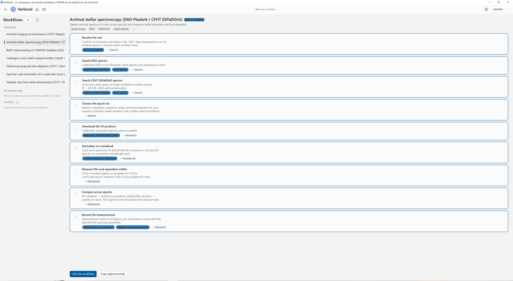

# Verbinal for Windows

**A CANFAR Science Portal companion and research platform** — a native Windows companion for the Canadian Astronomy Data Centre (CADC) and the [CANFAR Science Platform](https://www.canfar.net/), built with C#, WinUI 3, and the Windows App SDK. It brings the everyday work of an astronomer — finding archival data, inspecting images, running analysis, managing cloud storage and compute — into one fast, keyboard-friendly desktop app.

This is the Windows counterpart of [Verbinal for macOS](https://github.com/szautkin/canfar-macos) (SwiftUI), [Verbinal for Linux](https://github.com/szautkin/CanfarDesktopUbuntu) (Rust/GTK 4), and [Verbinal for Android](https://github.com/szautkin/canfar-android) (Kotlin/Jetpack Compose).

[](LICENSE)

## Screenshots


| 3D Cube Viewer | Workflows |
|:---:|:---:|
|  |  |

## Features

### [Search](docs/03-search.md) — CADC Archive
Query the CADC archive (CFHT, JCMT, DAO, Gemini, HST and more) with coordinate or target-name cone searches, a filterable data train (collection, instrument, filter, calibration level, dates), previews, saved ADQL queries, VizieR catalogue cone search, and one-click downloads into your local research archive.

### [Research](docs/04-research.md) — Archive & Notes
Downloaded observations are organized automatically, with previews, per-observation notes, and an exportable research bundle you can hand to collaborators.

### [FITS Viewer](docs/07-fits-viewer.md) — Astronomical Images
A hardware-accelerated 2D FITS viewer with WCS readout, coordinate go-to, pixel probing, bookmarks, multiple stretch modes and colormaps, North Up orientation, and multi-tab comparison (linked crosshair, sync zoom, blink). Opens fpack (`.fits.fz`) files directly.

### Cube Viewer — 3D Spectral Cubes
A Direct3D volume renderer for spectral cubes: fly around position-position-velocity space, scrub channels against an intensity waveform, shape the transfer function, probe spectra at any point, and export publication figures.

### [Notebook](docs/06-notebook.md) — Native Jupyter
Edit and run `.ipynb` files natively with a local Python kernel — no browser, no server setup. Seed ready-to-run analysis notebooks (quick-look imaging, aperture photometry, cube moment maps) directly from a downloaded observation.

### Workflows — Research Protocols
Step-by-step research protocols rendered as check-off step cards. Start from seven built-in astronomy templates or write your own in simple markdown with a live-preview editor. Store them locally or share them with your team via VOSpace.

### [Storage](docs/05-storage.md) — VOSpace Browser
Browse, upload, download, organize, and share your VOSpace/ARC files with quota tracking.

### [Portal](docs/02-portal.md) — Sessions & Batch Compute
Launch and manage CANFAR sessions (Jupyter, Desktop, CARTA, Firefly) and submit headless batch jobs with replicas; follow logs and events live. Image Discovery shows which software packages a container image carries before you launch it.

### AI Assistant (optional)
Connect Claude Desktop or Claude Code through a guided wizard and let an AI agent drive Verbinal with 115+ tools: search, download, open viewers, run notebooks, manage storage and sessions, and follow or author Workflows. You stay in control — a proposal review strip gates every consequential action, destructive operations always require explicit approval, and every agent change is badged.

### Cross-Module Integration
- **Search to FITS** — download from the archive, view in the FITS viewer, crosshair back to Search
- **Storage to FITS** — right-click a `.fits` file in VOSpace, open directly in the viewer
- **File Browser** — side panel with local navigation, routes `.fits`/`.ipynb` to the right module
- **Back Navigation** — move between modules without losing context

Authenticated features (Portal, Storage, compute) require a free CADC account; Search and the viewers work without signing in. The interface is available in **English and French** (Settings → General → Language).

## Installation

### Microsoft Store

Install directly from the [Microsoft Store](https://apps.microsoft.com/detail/9p8jqvk4pjch?ocid=webpdpshare).

### Build from source

```powershell
git clone https://github.com/szautkin/CanfarDesktop.git
cd CanfarDesktop
dotnet restore
dotnet build -c Debug
```

Or open `CanfarDesktop.slnx` in Visual Studio 2022 and run.

## Requirements

### Runtime
- Windows 10 (1809) or newer
- A CANFAR account (for Portal and Storage)
- Python 3.8+ (for Notebook execution)

### Build
- Visual Studio 2022 17.8+ with **.NET desktop development** and **Windows application development** workloads
- .NET 8 SDK
- Windows App SDK 1.8+

## Running Tests

```powershell
dotnet test CanfarDesktop.Tests
```

1,500+ tests covering: FITS parser and RICE decompression, WCS coordinate transforms, viewport math, blink alignment, notebook parser, dirty tracking, autosave, recovery, ADQL builder, data train, VOTable parsing, VOSpace, MCP tool routing, and more.

## Architecture

- **Language:** C# 12 / .NET 8
- **UI:** WinUI 3 (Windows App SDK 1.8) with Mica backdrop
- **Architecture:** MVVM with CommunityToolkit.Mvvm
- **DI:** Microsoft.Extensions.DependencyInjection (44 registrations, 18 interfaces)
- **Networking:** HttpClient with typed handlers, all HTTPS
- **Testing:** xUnit + NSubstitute
- **Packaging:** MSIX (Microsoft Store)
- **Security:** Windows PasswordVault for credentials, no telemetry

## Project Structure

```
CanfarDesktop.slnx            Solution file
CanfarDesktop.csproj           Main application project
Models/                        Data classes
  Fits/                        FITS image models (WcsInfo, FitsHeader, WorldCoordinate)
  Notebook/                    Jupyter notebook document model
Services/                      API clients and business logic
  Fits/                        FITS parser, renderer, coordinate store
  Notebook/                    Kernel service, autosave, recovery
  HttpClients/                 Auth token handling
Helpers/                       Pure utility functions
  Notebook/                    Notebook parser, ANSI, syntax highlighting
  ViewportMath.cs              Testable coordinate transforms
  BlinkAligner.cs              Blink comparison alignment math
ViewModels/                    MVVM ViewModels
  Notebook/                    Notebook tab host, cell VMs
Views/
  FitsViewer/                  FITS viewer pages + tab host
  Notebook/                    Notebook pages + tab host
  Controls/                    Reusable controls (session card, etc.)
  Dialogs/                     Login, delete, session events
docs/                          Feature documentation with screenshots
CanfarDesktop.Tests/           Unit tests (xUnit + NSubstitute)
```

## License

[GNU Affero General Public License v3.0](LICENSE)

Copyright (C) 2025-2026 Serhii Zautkin

## Privacy

See [PRIVACY.md](PRIVACY.md). No data collection, no telemetry, no third-party services. All data stays on your machine or goes directly to CANFAR.
