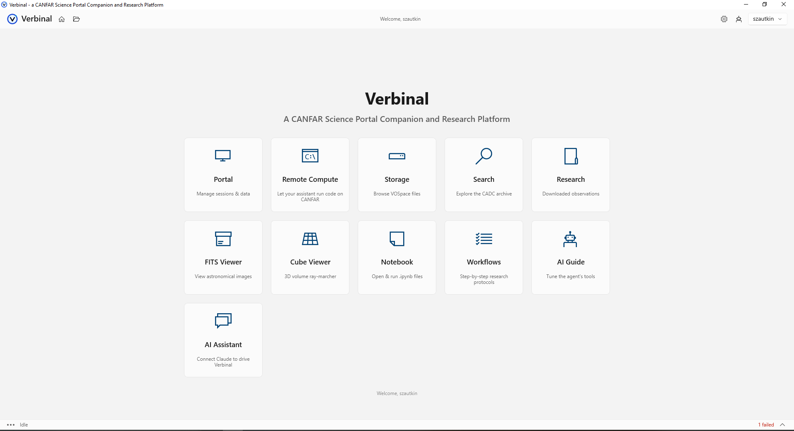
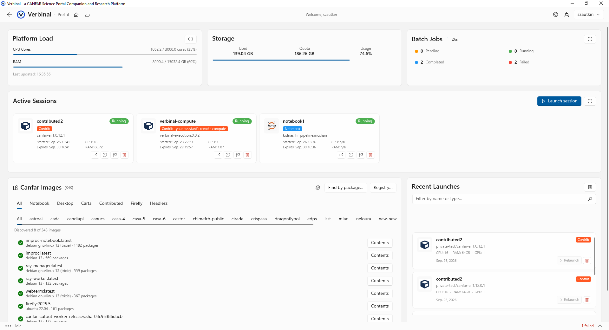
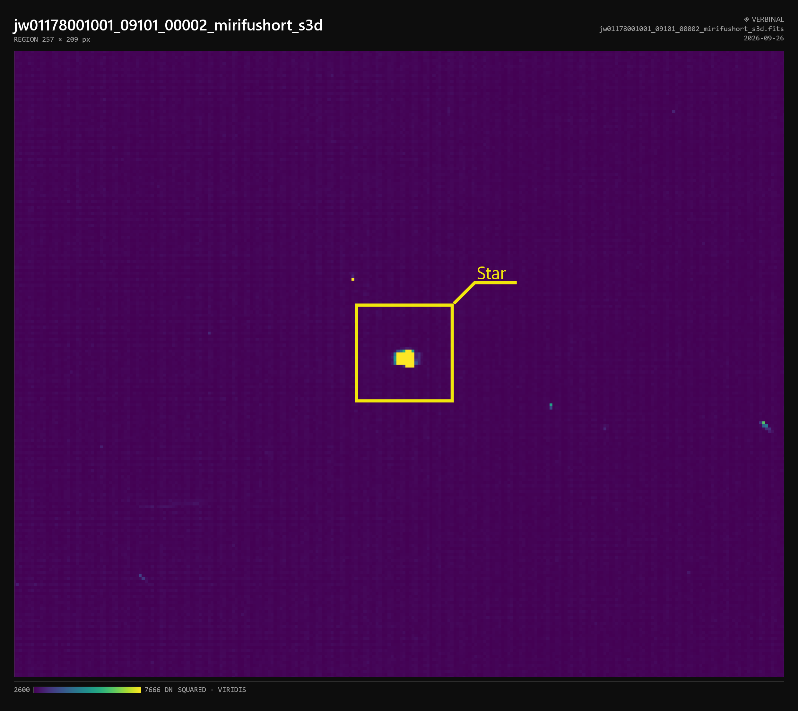
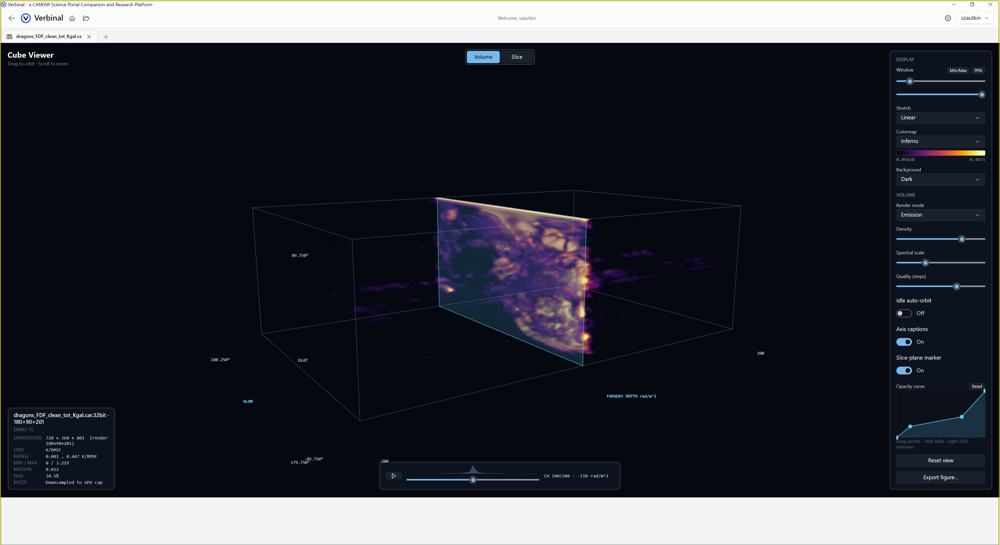
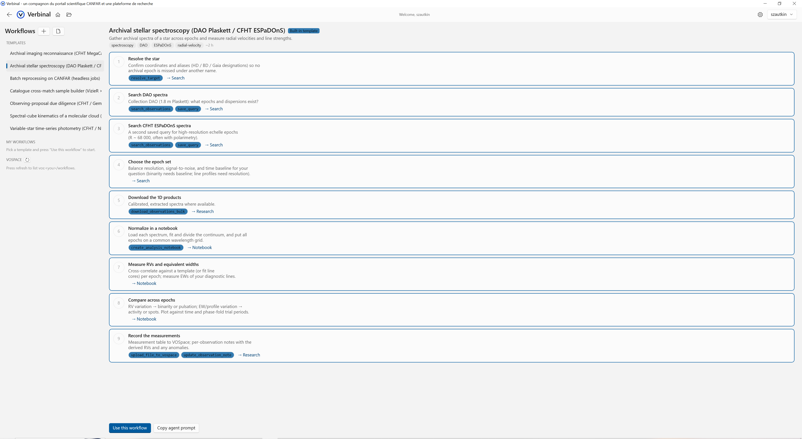

# Verbinal for Windows

**A CANFAR Science Portal companion and research platform** — a native Windows companion for the Canadian Astronomy Data Centre (CADC) and the [CANFAR Science Platform](https://www.canfar.net/), built with C#, WinUI 3, and the Windows App SDK. It brings the everyday work of an astronomer — finding archival data, inspecting images, running analysis, managing cloud storage and compute — into one fast, keyboard-friendly desktop app.

This is the Windows counterpart of [Verbinal for macOS](https://github.com/szautkin/canfar-macos) (SwiftUI), [Verbinal for Linux](https://github.com/szautkin/CanfarDesktopUbuntu) (Rust/GTK 4), and [Verbinal for Android](https://github.com/szautkin/canfar-android) (Kotlin/Jetpack Compose).

[](https://github.com/szautkin/CanfarDesktop/actions/workflows/ci.yml)
[](https://github.com/szautkin/CanfarDesktop/actions/workflows/codeql.yml)
[](https://github.com/szautkin/CanfarDesktop/releases/latest)
[](https://apps.microsoft.com/detail/9p8jqvk4pjch?ocid=webpdpshare)
[](#installation)
[](#installation)
[](https://dotnet.microsoft.com/)
[](https://learn.microsoft.com/windows/apps/windows-app-sdk/)
[](AGENTS.md)
[](LICENSE)

## Screenshots



| Portal | Marks and figure export |
|:---:|:---:|
|  |  |
| **3D Cube Viewer** | **Workflows** |
|  |  |

## Features

### [Search](docs/03-search.md) — CADC Archive
Query the CADC archive (CFHT, JCMT, DAO, Gemini, HST and more) with coordinate or target-name cone searches, a filterable data train (collection, instrument, filter, calibration level, dates), previews, saved ADQL queries, VizieR catalogue cone search, and one-click downloads into your local research archive. A long search can be cancelled; queries from the ADQL editor are kept in Recent searches; **Spatial cutout** and **Spectral cutout** cut each download to the search's region and wavelengths; and any cell, row or selection of rows copies as tab-separated text (Ctrl+C).

### [Research](docs/04-research.md) — Archive & Notes
Observations you download — or save without their files — are organized automatically, with previews, per-observation notes, and an exportable research bundle you can hand to collaborators. A cutout is kept as a record of its observation and leads back to the original. **Remove file** frees the disk and keeps the notes; **Download** brings the file back.

### Cutouts — Only the Part You Need
From an observation's Files tab or from Research, **Cutout…** opens an editor: a circle or box drawn on the file's footprint or typed as RA, Dec and size, and for a cube a wavelength range, checked as you type with the size estimated.
- **Cut by CADC** — its SODA service cuts the region on its side, so a few MB of a 1.6 GB MegaPipe tile download at full resolution
- **Cut on this computer** — from a file already downloaded, at once and offline, including files CADC will not cut: multi-extension HST and MegaPrime frames (choose which images to keep), cubes by box and wavelength, and fpack `.fz` files. Weight maps are cut with the very same pixel box, the WCS and SIP stay valid, DS9 and IRAF show the original pixel numbers, and every HDU carries a checksum astropy accepts

### [FITS Viewer](docs/07-fits-viewer.md) — Astronomical Images
A hardware-accelerated 2D FITS viewer with WCS readout (including SIP distortion for wide-field data), coordinate go-to, pixel probing, bookmarks, an Image Info summary, an HDU/extension selector, multiple stretch modes and colormaps, North Up orientation, mouse-wheel zoom, and multi-tab comparison (linked crosshair, sync zoom, blink). Opens fpack (`.fits.fz`) files directly, and very large images — a 1.6 GB MegaPipe tile — when there is memory for them.
- **Marks** — boxes, circles, callouts and text pinned to the sky; style and filter them, and export them as JSON or DS9 regions
- **Figure export** — PNG or PDF of the view or a selected region, up to 4×, with your marks, a header and a footer

### [Cube Viewer](docs/08-cube-viewer.md) — 3D Spectral Cubes
A Direct3D volume renderer for spectral cubes: fly around position-position-velocity space, scrub channels against an intensity waveform, shape the transfer function, probe spectra at any point, mark features, and export publication figures.

### [Notebook](docs/06-notebook.md) — Native Jupyter
Edit and run `.ipynb` files natively with a local Python kernel — no browser, no server setup. Seed ready-to-run analysis notebooks (quick-look imaging, aperture photometry, cube moment maps) directly from a downloaded observation.

### [Workflows](docs/09-workflows.md) — Research Protocols
Step-by-step research protocols rendered as check-off step cards. Start from seven built-in astronomy templates or write your own in simple markdown with a live-preview editor. Store them locally or share them with your team via VOSpace.

### [Storage](docs/05-storage.md) — VOSpace Browser
Browse, upload, download, organize, and share your VOSpace/ARC files with quota tracking.

### [Portal](docs/02-portal.md) — Sessions & Batch Compute
Launch and manage CANFAR sessions (Jupyter, Desktop, CARTA, Firefly) and submit headless batch jobs with replicas; follow logs and events live. Platform load, storage and batch jobs sit across the top, active sessions below, then the CANFAR images beside your recent launches; **Launch session** opens the launch form in a dialog. The images card lists only what a launch can start, filtered by session type and project, and Image Discovery shows which software packages an image carries before you launch it.

### Remote Compute — Code on CANFAR
The code you or your AI assistant run on your own CANFAR account, in view: the compute session's status with Start and Stop, every run with its code and output, and a box to run Python or Bash yourself. Off until you choose a compute image in Settings; it uses your own allocation.

### [AI Assistant](docs/10-ai-assistant.md) (optional)
Connect Claude Desktop or Claude Code through a guided wizard and let an AI agent drive Verbinal with 170+ tools: search, download, open viewers, run notebooks, manage storage and sessions, and follow or author Workflows. Any other MCP client — Codex, Copilot, Cursor, Gemini and the rest — connects the same way: [AGENTS.md](AGENTS.md) tells the agent how, so point your assistant at it. The assistant can look at the viewers, point at controls on screen, give you a guided tour of any screen, and open Settings to show you where something is set; it reconnects by itself when Verbinal restarts. You stay in control — a proposal review strip gates every consequential action, destructive operations always require explicit approval, and every agent change is badged.

### Cross-Module Integration
- **Search to FITS** — download from the archive, view in the FITS viewer, crosshair back to Search
- **Storage to FITS** — right-click a `.fits` file in VOSpace, open directly in the viewer
- **Research to Search** — a cutout leads back to its original observation, in Research or in Search
- **File Browser** — side panel with local navigation, routes `.fits`/`.ipynb` to the right module
- **Back Navigation** — move between modules without losing context

Authenticated features (Portal, Storage, compute) require a free CADC account; Search and the viewers work without signing in. The interface is available in **English and French** (Settings → General → Language).

## Installation

### Microsoft Store

Install directly from the [Microsoft Store](https://apps.microsoft.com/detail/9p8jqvk4pjch?ocid=webpdpshare).

### Build from source

```powershell
git clone https://github.com/szautkin/CanfarDesktop.git
cd CanfarDesktop
dotnet restore
dotnet build -c Debug
```

Or open `CanfarDesktop.slnx` in Visual Studio 2022 and run.

## Requirements

### Runtime
- Windows 10 (1809) or newer
- A CANFAR account (for Portal, Remote Compute and Storage)
- Python 3.8+ (for Notebook execution)

### Build
- Visual Studio 2022 17.8+ with **.NET desktop development** and **Windows application development** workloads
- .NET 8 SDK
- Windows App SDK 2.2 (restored from NuGet with the project)

## Running Tests

```powershell
dotnet test CanfarDesktop.Tests
```

3,400+ tests covering: FITS parser and RICE decompression, WCS coordinate transforms, local cutouts, viewport math, blink alignment, notebook parser, dirty tracking, autosave, recovery, ADQL builder, data train, VOTable and DataLink parsing, VOSpace, the MCP bridge and tool routing, and more. GitHub Actions builds the app and runs them on Windows for every push and pull request, with CodeQL and Dependabot beside it.

Against the running app, `scripts/mcp-smoke.ps1` checks the AI-agent surface end to end through the MCP bridge, as an assistant would (`-FitsPath` adds the FITS viewer):

```powershell
.\scripts\mcp-smoke.ps1 -FitsPath C:\Data\image.fits
```

## Architecture

- **Language:** C# 12 / .NET 8
- **UI:** WinUI 3 (Windows App SDK 2.2) with Mica backdrop
- **Architecture:** MVVM with CommunityToolkit.Mvvm
- **DI:** Microsoft.Extensions.DependencyInjection (44 registrations, 18 interfaces)
- **Networking:** HttpClient with typed handlers, all HTTPS
- **Testing:** xUnit + NSubstitute
- **Packaging:** MSIX (Microsoft Store)
- **Security:** Windows PasswordVault for credentials, no telemetry

## Project Structure

```
CanfarDesktop.slnx            Solution file
CanfarDesktop.csproj           Main application project
Models/                        Data classes
  Fits/                        FITS image models (WcsInfo, FitsHeader, WorldCoordinate)
  Notebook/                    Jupyter notebook document model
Services/                      API clients and business logic
  Fits/                        FITS parser, renderer, coordinate store
  Notebook/                    Kernel service, autosave, recovery
  HttpClients/                 Auth token handling
Helpers/                       Pure utility functions
  Notebook/                    Notebook parser, ANSI, syntax highlighting
  ViewportMath.cs              Testable coordinate transforms
  BlinkAligner.cs              Blink comparison alignment math
ViewModels/                    MVVM ViewModels
  Notebook/                    Notebook tab host, cell VMs
Views/
  FitsViewer/                  FITS viewer pages + tab host
  Notebook/                    Notebook pages + tab host
  Controls/                    Reusable controls (session card, etc.)
  Dialogs/                     Login, delete, session events
docs/                          Feature documentation with screenshots
CanfarDesktop.Tests/           Unit tests (xUnit + NSubstitute)
```

## License

[GNU Affero General Public License v3.0](LICENSE)

Copyright (C) 2025-2026 Serhii Zautkin

## Privacy

See [PRIVACY.md](PRIVACY.md). No data collection, no telemetry, no third-party services. All data stays on your machine or goes directly to CANFAR.
