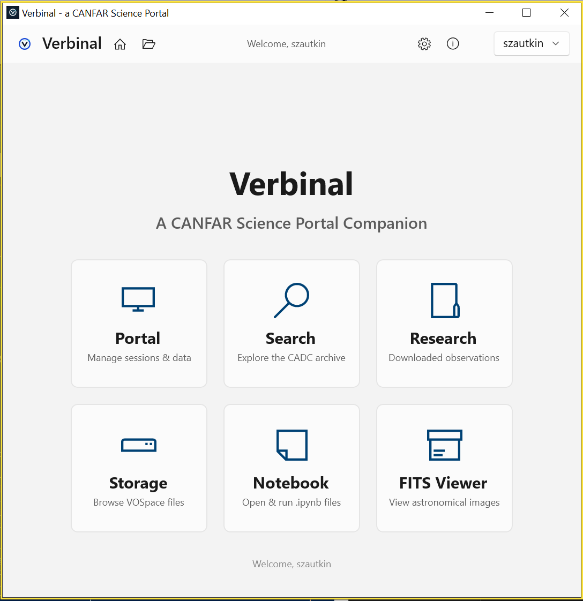

# Landing Page

The landing page is the home screen of Verbinal. Six tiles provide quick access to all modules.

## Features
- **Portal** — Manage CANFAR sessions (JupyterLab, CARTA, NoVNC)
- **Search** — Query the CADC astronomical archive
- **Research** — Browse downloaded observations
- **Storage** — Manage VOSpace cloud files
- **Notebook** — Open and run Jupyter notebooks locally
- **FITS Viewer** — View astronomical images with WCS coordinates

## Navigation
- Click any tile to enter that module
- The **Back** button returns to the previous module
- The **Home** button always returns to the landing page
- Login is required for Portal and Storage
