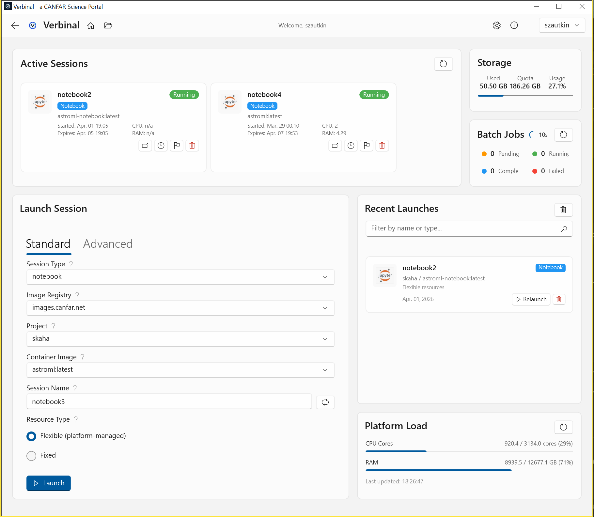

# Portal — Session Management

Manage CANFAR Science Portal sessions from the desktop.

## Features
- **Launch sessions** — JupyterLab, CARTA, NoVNC with custom resource allocation
- **Active sessions** — View running sessions with status badges, resource display
- **Session management** — Open in browser, renew, delete, view events and logs
- **Batch jobs** — Monitor and manage batch processing sessions
- **Platform load** — Real-time CPU, RAM, and instance metrics
- **Recent launches** — Quick access to previously launched configurations
