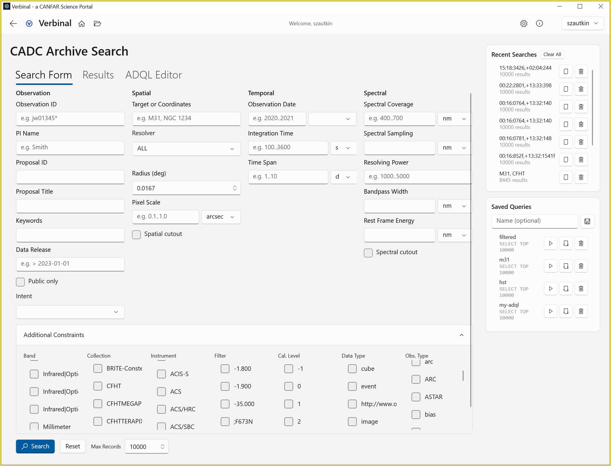

# Search — CADC Archive

Search the Canadian Astronomy Data Centre archive using TAP/ADQL.

## Features
- **Form-based search** — Target name, coordinates, date range, wavelength
- **Data train filters** — Cascading filters for band, collection, instrument, filter, calibration level
- **ADQL editor** — Write and execute custom ADQL queries
- **Results table** — Sort, filter per-column, pagination, column visibility
- **DataLink previews** — Preview images and thumbnails from observations
- **Download with progress** — Download FITS files with real-time progress indicator
- **Saved queries** — Save and reload frequently used queries
- **Recent searches** — Auto-saved search history with one-click restore
- **CSV/TSV export** — Export results for external analysis
- **Coordinate resolver** — Resolve target names to RA/Dec via CADC
