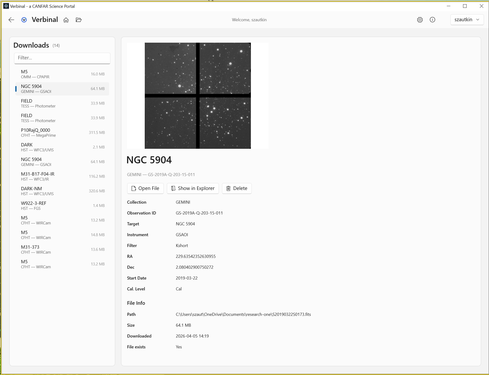

# Research — Downloaded Observations

Browse and manage observations downloaded from the CADC archive.

## Features
- **Observation cards** — Target name, instrument, file size, download date
- **Preview images** — Thumbnails from DataLink when available
- **Open in FITS Viewer** — One-click to view in the built-in image viewer
- **Show in Explorer** — Open the file location in Windows File Explorer
- **Delete** — Remove observations from the catalog and disk
