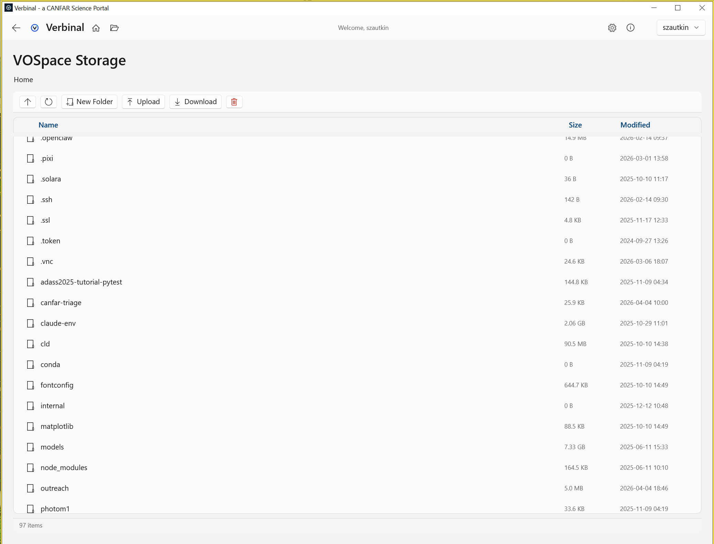

# Storage — VOSpace Browser

Browse and manage files on the CANFAR VOSpace cloud storage.

## Features
- **File browser** — Navigate folders with breadcrumbs and column sorting
- **Upload** — Upload files via button or drag-and-drop
- **Download** — Download files to local disk
- **Open in FITS Viewer** — Right-click a .fits file to view directly
- **Create folders** — Organize your VOSpace storage
- **Delete** — Remove files and folders with confirmation
- **Copy path** — Copy VOSpace URI to clipboard
- **Quota display** — Monitor storage usage
