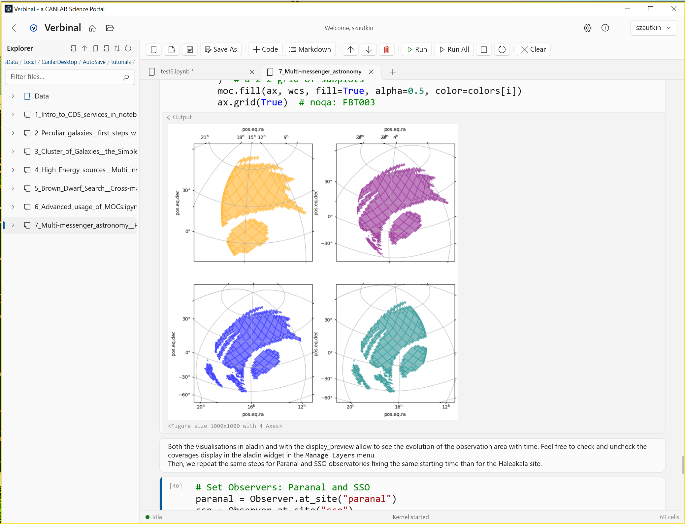

# Notebook — Jupiter

A native WinUI Jupyter notebook engine. Open, edit, and run .ipynb files locally.

## Features
- **Multi-tab** — Open multiple notebooks simultaneously
- **Local Python execution** — Run code cells with a local Python interpreter
- **Jupyter keyboard shortcuts** — A/B (add cells), DD (delete), C/V (copy/paste), Enter/Escape (edit/command mode)
- **Syntax highlighting** — Python keywords, strings, comments with theme-aware colors
- **Magic commands** — `%pip install`, `%conda`, `!shell` commands
- **Matplotlib inline** — Render plots inline via the Agg backend
- **Colab compatibility** — google.colab mock, /content/ path rewriting
- **Autosave** — 30-second interval with crash recovery
- **File support** — Open .ipynb, .py, and .md files
- **Undo/redo** — Structural undo for cell operations
