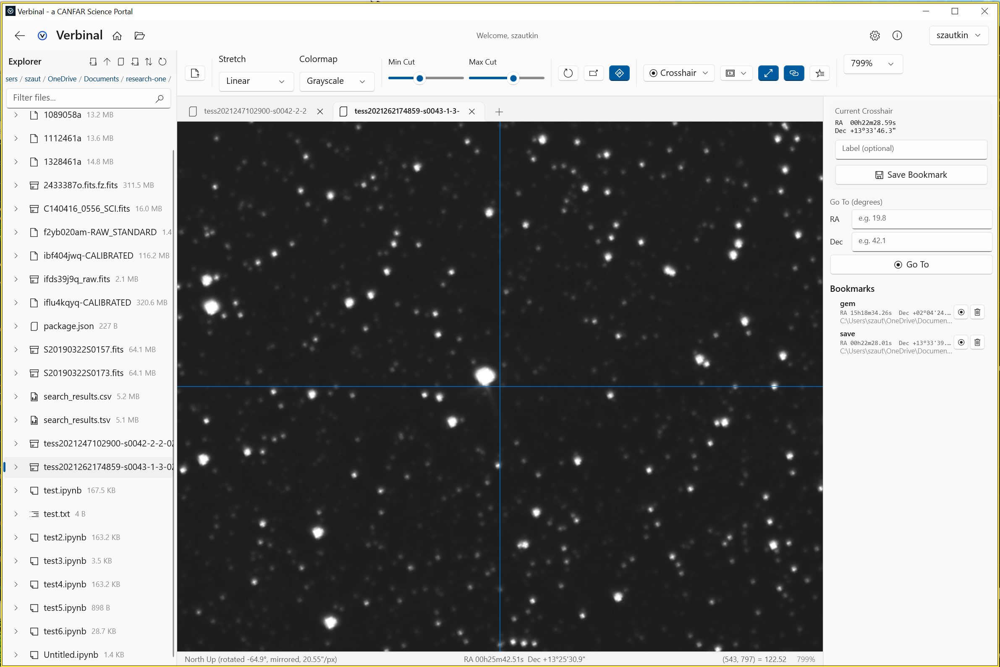

# FITS Viewer

A native FITS image viewer with WCS coordinate support, multi-tab comparison, and blink analysis.

## Image Display
- **All BITPIX types** — 8, 16, 32, -32, -64 bit images
- **Stretch modes** — Linear, Log, Sqrt, Squared, Asinh
- **Colormaps** — Grayscale, Inverted, Heat, Cool, Viridis
- **Min/Max cuts** — Adjustable contrast with auto-cut percentile
- **Zoom** — Scroll wheel + editable preset dropdown (25% to 1200%)
- **Pan** — Click and drag to pan the image

## WCS Coordinates
- **Crosshair** — Right-click to place, shows RA/Dec and pixel value on hover
- **North Up** — Toggle to orient image with celestial North up
- **Search at Position** — Send crosshair coordinates to CADC search
- **Copy RA/Dec** — Copy coordinates to clipboard
- **Saved bookmarks** — Save and navigate to coordinate positions

## Multi-Image Comparison
- **Multi-tab** — Open multiple FITS files in tabs
- **Linked crosshair** — Place crosshair in one tab, see it in all others at the same sky position
- **Sync zoom** — Match angular extent across tabs with different pixel scales
- **Blink comparison** — Smooth fade between two images to detect changes

## FITS Header
- **Header panel** — View all FITS header keywords with search/filter
- **HDU selection** — Switch between image extensions
