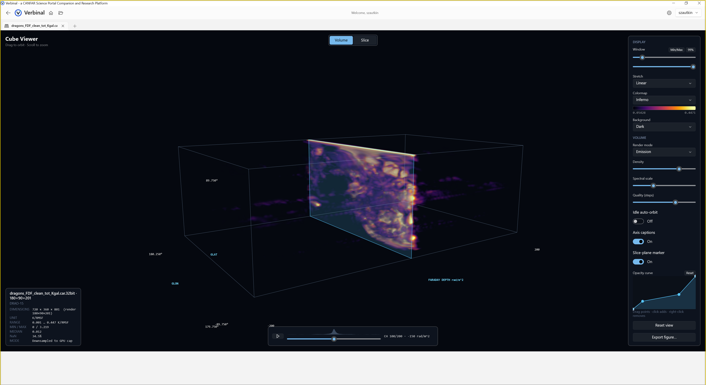

# Cube Viewer

A Direct3D 3D volume renderer for FITS spectral cubes.

## Volume Rendering
- **GPU raymarching** — real-time volume rendering of position-position-velocity (PPV) cubes
- **Transfer function** — shape opacity and color across intensity to reveal structure
- **Camera** — orbit, pan, and zoom freely around the cube

## Spectral Analysis
- **Channel scrubbing** — step through spectral channels against an intensity waveform
- **Spectrum probe** — click any point to read its spectrum along the third axis
- **WCS-aware** — the spectral axis is interpreted from `CTYPE3` (frequency / wavelength / velocity)

## Export
- **Publication figures** — export the current view as an image

The viewer opens FITS files with a real spectral third axis. Files with a non-spectral third axis (e.g. a detector stack) are best viewed in the [FITS Viewer](07-fits-viewer.md); the app recommends the right viewer but always lets you choose.
