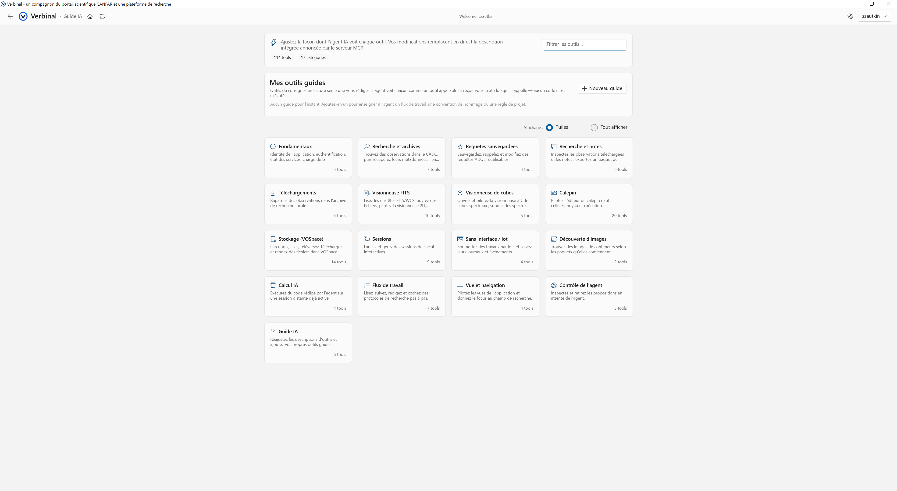

# AI Assistant

Connect an AI agent — Claude Desktop or Claude Code — to drive Verbinal over the Model Context Protocol (MCP). Optional and off by default.

## Guided connection
- **Connect wizard** — a step-by-step wizard pairs an AI agent with the app over MCP
- **115+ tools** — the agent can search, download, open the viewers, run notebooks, manage storage and sessions, and follow or author [Workflows](09-workflows.md)

## You stay in control
- **Proposal review strip** — every consequential action is proposed for your review before it runs
- **Destructive actions gated** — deletes and teardown always require explicit approval
- **Change badges** — everything an agent changed is marked with a badge

## AI Guide
- **Tune tool descriptions** — adjust how the agent sees each built-in tool
- **Add your own guide entries** — teach the agent project conventions and workflows (read-only; no code runs)
